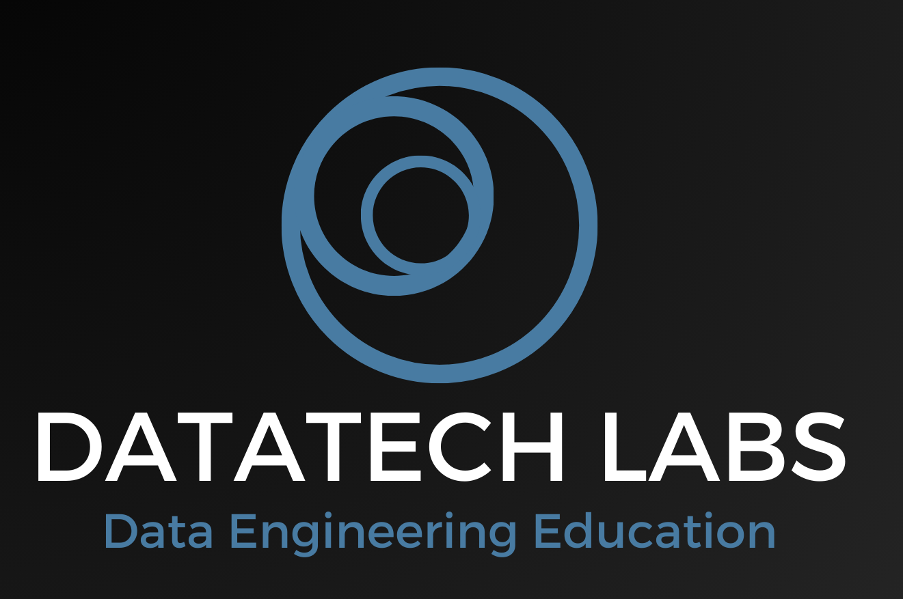

# DataTech Labs Representing a "Data Engineering" Course
This repository contains the course materials for a Data Engineering course. The course is designed to provide students with hands-on experience in data engineering, including Python programming, SQL, and data processing. The course is divided into several modules, each covering a different aspect of data engineering.

## Course Description
**Course Title**: Foundations of Data Engineering and Big Data Systems

The course is divided into the following modules:
- [Week 1: Introduction to Data Engineering & Data Modeling](week1/README.md)
- [Week 2: Data Pipelines and Big Data Processing](week2/README.md)
- [Week 3: Data Lakes and Data Warehousing With Modern Data Architectures](week3/README.md)
- [Week 4: Advanced Data Processing with Spark and Streaming Pipelines](week4/README.md)
- [Week 5: Data Automation, Orchestration and Visualization](week5/README.md)
- [Week 6: Cloud-Based Big Data Services](week6/README.md)
- [Week 7: Project Week](week7/README.md)

This comprehensive course introduces students to the principles and practices of data engineering and big data systems. Students will learn to design, implement, and maintain large-scale data processing systems, gaining hands-on experience with industry-standard tools and technologies. The course covers data modeling, ETL processes, distributed computing, data warehousing, and real-time data processing.

### **Learning Objectives**:

By the end of this course, students will be able to:
1. Understand the fundamentals of data engineering and its role in modern organizations
2. Design and implement efficient data pipelines and ETL processes
3. Work with distributed computing frameworks like Hadoop and Spark
4. Develop skills in data modeling and database design for big data systems
5. Implement and manage data warehouses and data lakes
6. Understand and implement real-time data processing systems
7. Utilize cloud-based big data services and technologies
8. Develop a comprehensive big data project for a real-world problem

## Weekly Breakdown:

### Week 1: Introduction to Data Engineering & Data Modeling
- Introduction to Data Engineering
    - Overview of data engineering and its importance
    - The data engineering ecosystem and toolchain
    - Roles and responsibilities of a data engineer
    - Basic data engineering concepts and terminology

    Reading: "Fundamentals of Data Engineering" by Joe Reis and Matt Housley (Chapters 1-2)

- Data Modeling and Database Design
    - Relational vs. NoSQL databases
    - Data modeling techniques for big data
    - Introduction to distributed database systems
    - Hands-on: Designing a data model for a sample use case

    Reading: "Data Model Patterns: Conventions of Thought" by David C. Hay (Chapters 1-3)

### Week 2: Data Pipelines and Big Data Processing
- ETL Processes and Data Pipelines
    - Understanding Extract, Transform, Load (ETL) processes
    - Designing efficient data pipelines
    - Data quality and data cleansing techniques
    - Hands-on: Building a simple ETL pipeline using Python

    Reading: "Building Data Pipelines with Python" by Kirrill Pomogajko (Chapters 1-4)

- Introduction to Big Data & Distributed Computing
    - Principles of distributed systems
    - The Hadoop ecosystem: HDFS, MapReduce, YARN
    - Introduction to Apache Spark
    - Hands-on: Setting up a Hadoop cluster and running basic operations

    Reading: "Hadoop: The Definitive Guide" by Tom White (Chapters 1-3)

### Week 3: Data Lakes and Data Warehousing With Modern Data Architectures
- Data Lakes Design and Implementation
    - Understanding data lakes and their benefits
    - Data lake design patterns and best practices
    - Introduction to Delta Lake and data lakehouse concept
    - Hands-on: Setting up a data lake using cloud storage

    Reading: "Data Lakes for Dummies" by Alan R. Simon (Chapters 1-5)

- Data Warehousing and Modern Data Architectures
    - Data warehouse architectures and design principles
    - Dimensional modeling and star schemas
    - OLAP concepts and cube operations
    - Hands-on: Designing and implementing a simple data warehouse

    Reading: "The Data Warehouse Toolkit" by Ralph Kimball and Margy Ross (Chapters 1-4)

### Week 4: Advanced Data Processing with Spark and Streaming Pipelines
- Advanced Spark Programming
    - Spark RDDs, DataFrames, and Datasets
    - Spark SQL and analytics
    - Machine learning with Spark MLlib
    - Hands-on: Implementing data transformations and analytics with Spark

    Reading: "Learning Spark" by Jules S. Damji et al. (Chapters 1-5)

- Streaming Data Processing
    - Introduction to stream processing concepts
    - Apache Kafka for real-time data ingestion
    - Stream processing with Spark-Streaming
    - Stream processing with Apache Flink
    - Hands-on: Implementing a real-time data pipeline with Kafka and Flink

    Reading: "Kafka: The Definitive Guide" by Neha Narkhede et al. (Chapters 1-4)

### Week 5: Data Automation, Orchestration and Visualization
- Data Automation and Orchestration
    - Workflow automation with Apache Airflow
    - Job scheduling and monitoring
    - Data pipeline orchestration best practices
    - Hands-on: Building and scheduling data workflows with Airflow

    Reading: "Data Pipelines Pocket Reference" by Christopher Groskopf (Chapters 1-3)

- Data Visualization and Reporting
    - Data Visualization Principles
    - Reporting Tools (Tableau, Power BI)
    - Create effective data visualizations.
    - Hands-on: Use reporting tools for data presentation.

    Readings: Tutorials on Tableau or Power BI

### Week 6: Cloud-Based Big Data Services
- Cloud-based Big Data Services
    - Overview of cloud computing for big data
    - Amazon Web Services (AWS) big data services
    - Google Cloud Platform (GCP) big data services
    - Hands-on: Deploying a big data application on a cloud platform

    Reading: "Big Data Analytics on Cloud" by Pethuru Raj et al. (Chapters 1-4)

### Week 7: Project Week
- Course Project Presentations and Review
    - Student project presentations
    - Course review and future learning paths
    - Industry guest speaker session
    - Q&A and feedback session

---------------------------------------------------------------------------------------
### Extra Weeks (might be later added):
Week (x): Data Governance and Security
- Data governance frameworks and best practices
- Data security and privacy considerations
- Implementing data lineage and metadata management
- Hands-on: Setting up data access controls and encryption

Reading: "Data Governance: How to Design, Deploy, and Sustain an Effective Data Governance Program" by John Ladley (Chapters 1-3)

Week (x): Data Quality Management
- Data quality dimensions and metrics
- Implementing data quality checks in pipelines
- Data profiling and cleansing techniques
- Hands-on: Developing a data quality dashboard

Reading: "Executing Data Quality Projects" by Danette McGilvray (Chapters 1-3)

Week (x): Performance Tuning and Optimization
- Performance bottlenecks in big data systems
- Query optimization techniques
- Distributed system performance tuning
- Hands-on: Optimizing a Spark application for better performance

Reading: "High Performance Spark" by Holden Karau and Rachel Warren (Chapters 1-4)

Week (x): Emerging Trends in Data Engineering
- Machine learning operations (MLOps)
- Data mesh architecture
- Serverless data processing
- Edge computing and IoT data processing

Reading: Selected research papers and articles (to be provided)

## Evaluation and Assessment:
Evaluation Methods:
1. Weekly quizzes (20%): Short quizzes to assess understanding of key concepts
2. Hands-on assignments (30%): Practical tasks to apply learned skills
3. Midterm project (20%): Design and implement a data pipeline for a given scenario
4. Final project (30%): Develop a comprehensive big data solution for a real-world problem

### Required Technologies:
- Python 3.x
- Apache Hadoop
- Apache Spark
- Apache Kafka
- Apache Flink
- SQL database (e.g., PostgreSQL)
- NoSQL database (e.g., MongoDB)
- Cloud platform account (AWS or GCP)

### Teaching Methodologies:
- Interactive lectures with live coding demonstrations
- Hands-on lab sessions for practical skill development
- Case studies and real-world problem-solving exercises
- Group discussions and peer code reviews
- Guest lectures from industry professionals

### Additional Resources:
- Online documentation for various big data technologies
- Research papers and industry white papers
- Online forums and communities (e.g., Stack Overflow, Data Engineering subreddit)

### Office Hours:
Instructor will be available for virtual office hours twice a week to address student questions and provide additional guidance.

This syllabus provides a comprehensive overview of a Data Engineering / Big Data Engineering course. It's designed to progressively build knowledge and skills, starting with fundamentals and moving to more advanced topics. The course incorporates a mix of theoretical knowledge and practical, hands-on experience with current industry tools and technologies. Regular assessments and a final project ensure that students can apply their learning to real-world scenarios.
